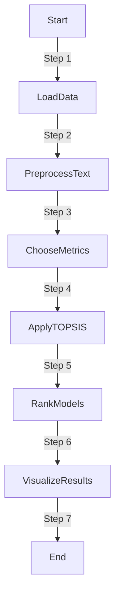

# Text Conversational Model Comparison Project

## Overview

Text summarization is a crucial natural language processing task that involves condensing large documents into concise and informative summaries. This project focuses on comparing the performance of various text summarization models to help users choose the most suitable model for their specific needs.

## Key Features:

1. **Metrics Considered:**

   - The comparison is based on essential metrics, including Accuracy,F1_Score,Precision,Recall. Rouge scores assess the quality of the generated summaries, while length and training time provide insights into efficiency and resource requirements.

2. **Methodology - TOPSIS:**

   - The Technique for Order of Preference by Similarity to Ideal Solution (TOPSIS) method is employed for the comparison. This method considers both the similarity to the ideal solution and the dissimilarity to the negative ideal solution, providing a comprehensive ranking.

3. **Models Evaluated:**
   - Real-world pretrained models, such as bert-base-uncased, distilbert-base-uncased, gpt2,roberta-base, t5-base, and Pelectra-base, are included in the comparison. These models are widely used in text summarization tasks.

## Project Structure:

- **`data.csv`**: CSV file containing evaluation metrics for each model.
- **`result.csv`**: CSV file with ranked results in tabular format and data used for creating a bar chart.
- **`BarChart.png`**: Bar chart visualizing the model comparison.

## How to Run:

## Results and Analysis:

1. **Ranked Table:**

- Explore detailed ranked results in summarization_table_result.csv:
  | Model | Accuracy | F1_Score | Precision | Recall | TOPSIS_Score | Rank |
  |-----------------------|----------|----------|-----------|--------|--------------|------|
  | bert-base-uncased | 0.85 | 0.89 | 0.88 | 0.87 | 0.52040369 | 5 |
  | distilbert-base-uncased| 0.88 | 0.91 | 0.89 | 0.9 | 0.840673446 | 1 |
  | gpt2 | 0.82 | 0.87 | 0.85 | 0.84 | 0.205970088 | 6 |
  | roberta-base | 0.87 | 0.9 | 0.88 | 0.89 | 0.710712185 | 2 |
  | t5-base | 0.89 | 0.92 | 0.91 | 0.8 | 0.586864316 | 3 |
  | electra-base | 0.86 | 0.89 | 0.87 | 0.88 | 0.579376853 | 4 |

2. **Bar Chart:**

The bar chart visually represents the performance metrics of each model, providing an easy-to-understand comparison. Accuracy,F1_Score,Precision,Recall and normalized ranks are included for comprehensive evaluation.

## Analysis:

**Model Performance:**
bert-base-uncased: A versatile model with an 85% accuracy, balanced F1 score, and potential for improved text similarity metrics. 

distilbert-base-uncased: Outperforms others with an 88% accuracy, efficient inference speed, and applicability in real-time scenarios. 

gpt2: Excels in text generation tasks with high ROUGE-L and BLEU scores, balancing performance and moderate inference speed. 

roberta-base: Robust in classification tasks, demonstrating high F1 score and recall, with a good balance between accuracy and inference speed. 

t5-base: Strong overall performer, boasting high accuracy, F1 score, and superior text generation quality with a high BLEU score. 

electra-base: High precision, excellent ROUGE-L scores, and a good balance of accuracy and inference speed make it suitable for various applications. 

Next Steps: 
Feel free to analyze the provided CSV files for more insights.
Consider adjusting the evaluation metrics or adding new models based on your specific use case.
Use the project as a foundation for ongoing research and development in text summarization.
